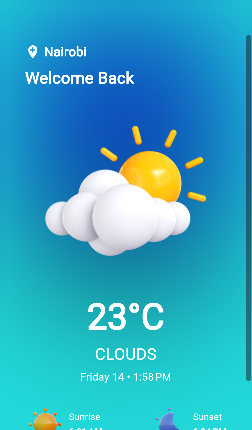
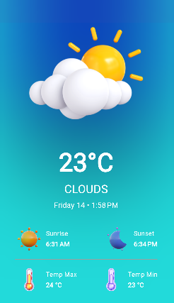

## A Simple Weather App Using Bloc State Management and Open Weather API

A Flutter project that displays the weather information of the user's current location using Bloc state management.

### Features

- Asks for location permission from the user.
- Fetches the weather data using the OpenWeather API.
- Displays temperature (min and max), sunrise, sunset, and humidity.

### Screenshots


<p >
  
  
  
</p>

## Packages Used

- [flutter_bloc](https://pub.dev/packages/flutter_bloc)
- [bloc](https://pub.dev/packages/bloc)
- [geolocator](https://pub.dev/packages/geolocator)
- [weather](https://pub.dev/packages/weather)
- [equatable](https://pub.dev/packages/equatable)

## Getting Started

### Prerequisites

- Flutter installed on your local machine. You can follow the instructions [here](https://flutter.dev/docs/get-started/install) to install Flutter.
- An OpenWeather API key. You can get one by signing up [here](https://openweathermap.org/api).

### Installation

1. Clone the repository:

```sh
git clone https://github.com/mikeyolang/weatherapp.git
```

2. Navigate to the project directory:

```sh
cd weatherapp
```

3. Install the dependancies

```sh
flutter pub get
```

### Running the App

1. Connect your device or start an emulator.
2. Run the app:

```sh
flutter run
```

## Project Structure

```lua
lib/
|-- blocs/
|-- constants/
|-- screens/
|   |-- home_screen.dart
|-- main.dart
```

- `blocs/`: Contains the BLoC (Business Logic Component) files for managing the state of the app.
- `constants/`: Contains the images and the API key file.
- `screens/`: Contains the UI of the app.
- `main.dart`: The entry point of the app.

## Usage

- On app launch, the user will be prompted to allow location access.
- If the user grants permission, the app will fetch and display the current weather information for the user's location using the OpenWeather API.

## Download APK

You can download the APK file from the following link:
[Download APK](https://drive.google.com/file/d/16dw0pNMtaFGYxR6gzEFLGGKXOfIwQqWE/view?usp=sharing).
